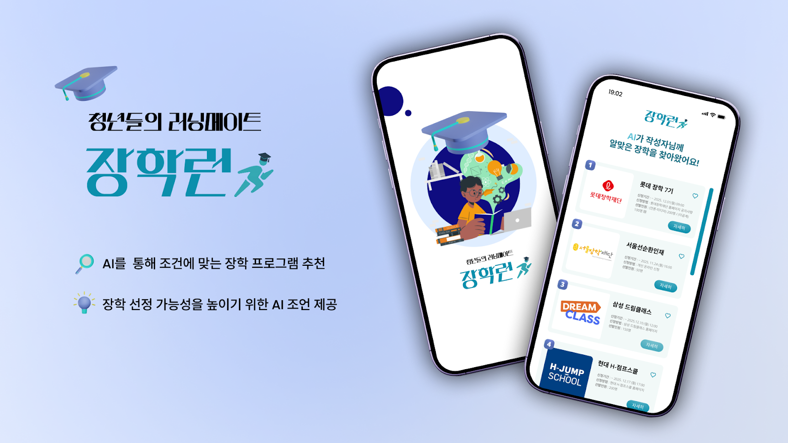
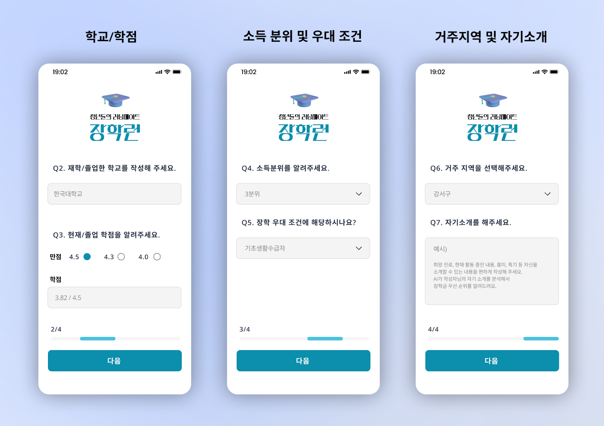
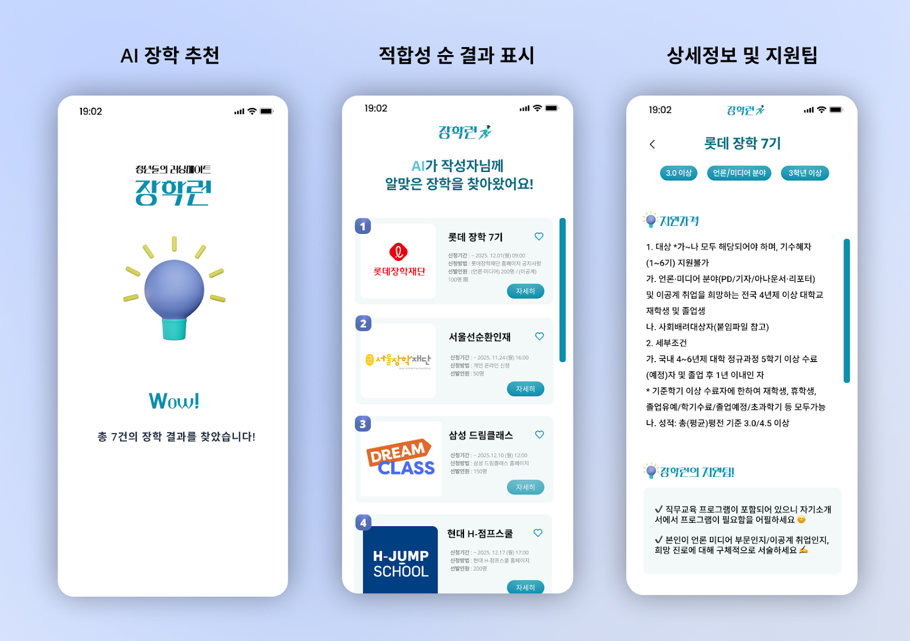
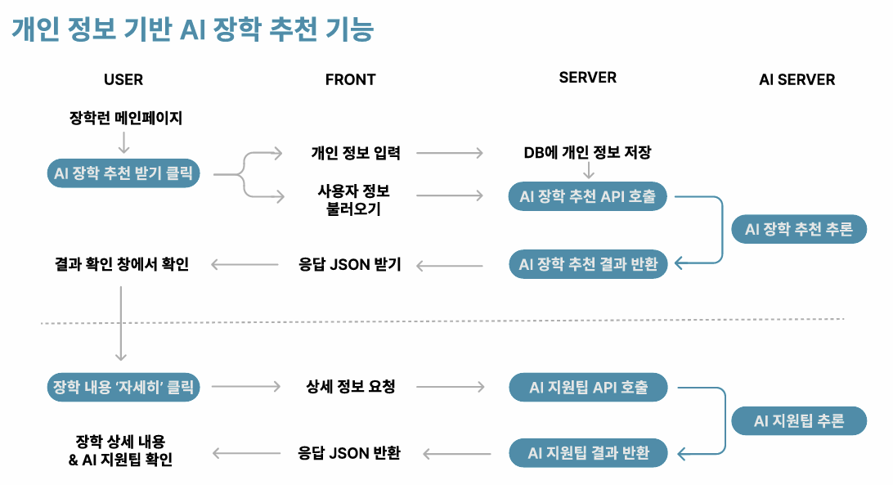
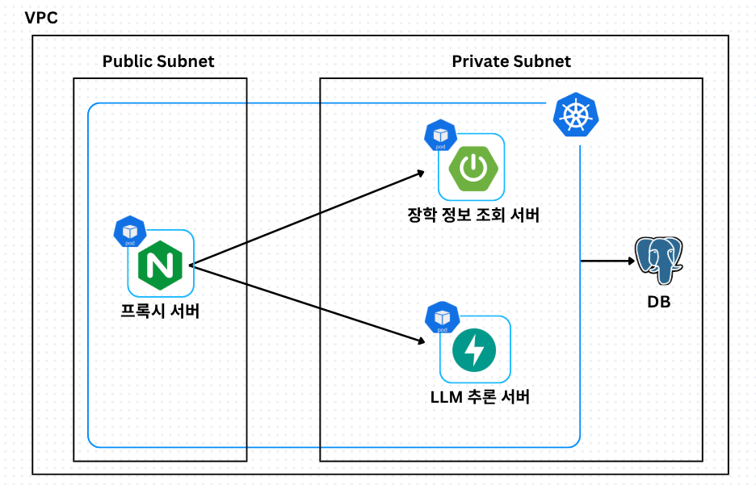
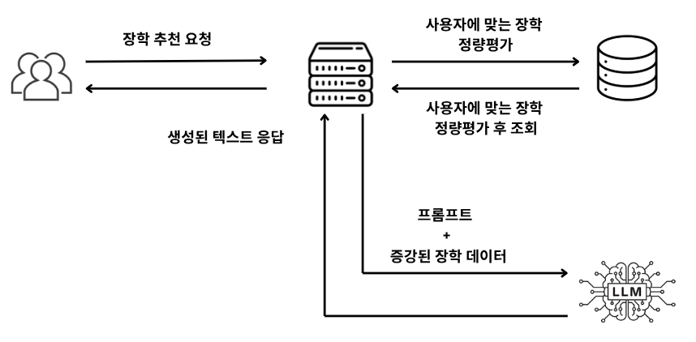

# 📘 청년들의 러닝메이트 **장학런(JangHakRun)**
AI 기반 개인 맞춤형 장학금 추천 서비스

> **“멈칫하는 청춘은 없다. 너의 미래, 장학금으로 풀매수!”**  
> 장학런은 개인 상황을 자동 분석하여  
> **조건 맞는 장학금 + 정량 기반 매칭 + LLM 자기소개서 조언**까지 제공하는  
> 청년 맞춤형 장학 탐색 서비스입니다.

---

## 🌟 1. 서비스 Overview  



**장학런(JangHakRun)** 은 서울시 청년들이 겪는  
“장학 정보 탐색 불편”, “정보 부족으로 신청을 놓치는 문제”를 해결하기 위해 만들어졌습니다.

### ❗ 청년 장학 정보 탐색의 현실  
- **78.3%**: “장학 정보 탐색이 매우 불편하다”  
- **58.9%**: “정보 부족으로 장학 프로그램을 놓친 경험이 있다”  
- 취약계층의 장학 놓침 경험은 **71.4%**로 일반계층(46.2%) 대비 현저히 높음  
- **79.7%가 AI 기반 추천 서비스 사용 의향**이 있다고 응답  

---

## 🎯 2. 제안 배경 및 목적

1) 장학 정보가 여러 기관·사이트에 분산  
2) 전공·소득·성적 조건을 직접 비교해야 함  
3) 개인별 맞춤 추천이 아닌 단순 공고 나열 방식

### 장학런의 해결 방식
1. **데이터 수집:** 서울시 장학 데이터 + 자체 크롤링  
2. **사용자 정보 입력:** 학교·학점·소득분위·우대조건·지역·자기소개  
3. **AI 정량 추천:** 조건 기반 점수화 + Rerank  
4. **AI 자기소개서 조언:** LLM 기반 지원전략 제공  

---

## 📱 3. 서비스 주요 기능




---

## 🤖 4. AI 모델 및 데이터셋

### 📘 활용 데이터셋
- AI-Hub 논술형/서술형/주제별 글쓰기 데이터  
- 서울시 장학 정보 (공개 API + 자체 크롤링)

### 🤖 모델 구성
- **gte-multilingual-reranker-base** (정량 평가)  
- **HyperCLOVAX LLM** (자기소개서 분석 및 팁 생성)  
- LoRA Fine-tuning + Quantization 적용

---

## 🧩 5. 서비스 플로우


---

## ☁️ 6. 아키텍처



---

## 🤖 7. 장학 추천 + LLM 구조



---

## 🛠 8. Tech Stack

| 구분 | 기술 |
|------|------|
| Backend-Server | Java · Spring Boot · PostgreSQL |
| Backend-AI | Python · FastAPI · HuggingFace |
| Frontend | React · JavaScript |
| Infra | Terraform · Kubernetes · Nginx |

---

## 📂 9. Folder Structure

```
/ (root)
 ├── README.md
 ├── backend-server/
 ├── backend-ai/
 ├── frontend/
 ├── infra/
 └── assets/
```

---

## 🎉 11. 기대 효과

### 🧑‍🎓 학생
- 조건 기반 추천으로 신청 누락 방지  
- AI 자기소개서 코칭 제공  

### 🏛 장학 재단
- 다양한 지원자 확보  
- 장학 프로그램 실질 수혜율 증가  

### 🏫 교육기관
- 장학 안내 효율 증가  

### 🏙 서울시
- 정보 접근성 격차 완화  
- 중복 지원·누락 방지  
